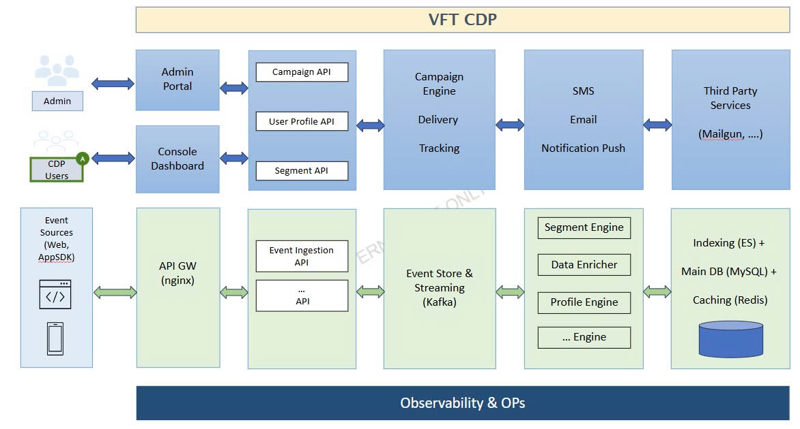
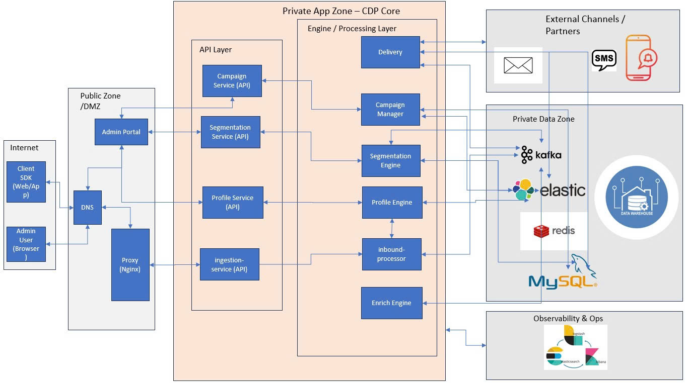
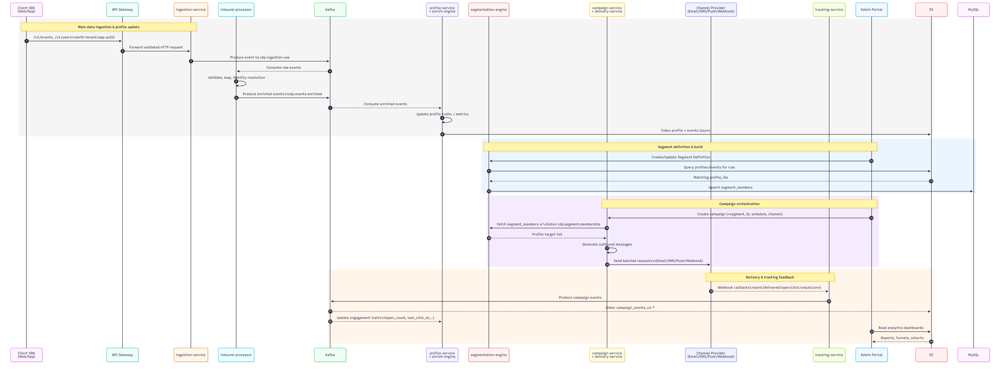

# CDP Platform – System Architecture

## 1. Overview

**High-level architecture**

**Detailed architecture**

This repository contains a Customer Data Platform (CDP) built with a microservice architecture.

Core capabilities:

- **Data Ingestion**: `/track`, `/identify`, bulk import.
- **Profiles & Identity**: unify user identifiers and attributes.
- **Segmentation**: rule-based and file-based segments.
- **Campaigns**: outbound activation (email, SMS, push, webhooks, in-app).
- **Tracking & Attribution**: campaign open/click/unsubscribe/conversion tracking.
- **Consent & Privacy**: manage user consents (email, SMS, etc.).
- **Streams**: real-time export to external systems.

**High-level Sequence Flow**

## 2. High-level components

- **Frontend**
  - `admin-portal`: React/Next.js UI for configuration, segments, workflows, campaigns, debugging.

- **API Gateway / Edge**
  - Public API entry points: `/v1/events`, `/v1/users`, `/v1/devices`, `/v1/bulk/import`, `/t/c|/t/o|/t/u`, admin APIs.

- **Core Services (services/)**
  - `ingestion-service`: receives user & event data, writes to Kafka `cdp.ingestion.raw`.
  - `inbound-processor`: validates, maps, enriches raw events → `cdp.events.enriched`.
  - `profile-service`, `profile-engine`: manages profiles, identifiers, attributes, search and merge/delete.
  - `segmentation-service`, `segmentation-engine`: manages segment definitions, create/update segment (filter + file).
  - `campaign-service`, `campaign-manager`: defines campaigns, config schedules, messages, pushes to channels, campaigns tracking (click/open/unsubscribe + conversions),....
  - `Delivery`: scan schedules config of campaign, get list profiles by segment_id and push to external channnels (email/sms/webhook/notification app)
 

- **Shared libraries (libs/)**
  - `cdp-common`: shared domain models (Profile, Event, SegmentDefinition, CampaignEvent, etc.), enums, helpers.
  - `cdp-kafka`: common Kafka producer/consumer wrapper.
  - `cdp-es`: Elasticsearch client and query builders.
  - `cdp-auth`: JWT + RBAC helpers.
  - (Optional) `cdp-logging`: common logging & tracing utilities.

- **Infrastructure (infra/)**
  - `k8s/`: Kubernetes manifests and Kustomize overlays.
  - `kafka/`: topics configuration and schemas.
  - `mysql/`: schema + seed data.
  - `elasticsearch/`: index mappings.
  - `monitoring/`: ELK.

## 3. Data stores

- **MySQL**
  - `segments`, `segment_members`, `segment_build_jobs`
  - `campaigns`, `campaign_messages`, `campaign_events`
  - `consent_policies`, `profile_consents`
  - `imports`, `segment_file_imports`

- **Elasticsearch**
  - `profiles_v1`: indexed profiles and traits.
  - `events_v1-*`: time-based events indices.
  - `segments_v1`: search segments.
  - `campaign_events_v1-*`: campaign tracking events.

- **Kafka topics (examples)**
  - Ingestion: `cdp.ingestion.raw`, `cdp.events.enriched`.
  - Profiles: `cdp.profile.created`, `cdp.profile.updated`, `cdp.profile.merged`, `cdp.profile.deleted`.
  - Segments: `cdp.segment.jobs`, `cdp.segment.file.jobs`, `cdp.segment.membership`.
  - Campaigns: `cdp.campaign.delivery.events`.
  - Imports: `cdp.import.jobs`, `cdp.import.records`.

## 4. Typical flows

### 4.1. Track → Profile & Event

1. SDK → API Gateway → `ingestion-service` (`/v1/events`, `/v1/users`).
2. `ingestion-service` writes messages to `cdp.ingestion.raw`.
3. `inbound-processor` consumes `cdp.ingestion.raw`:
   - validates and maps payloads,
   - performs identity resolution,
   - writes enriched events to `cdp.events.enriched`.
4. Consumers of `cdp.events.enriched`:
   - `event-service`: index events in ES.
   - `profile-service`: update profiles if needed.

### 4.2. Segment → Campaign

1. `segmentation-service` defines segments (filter-based or file-based).
2. Batch engine builds `segment_members` and emits membership events on `cdp.segment.membership`.
3. `campaign-service` generates campaign messages for audience (segment and schedule, channel).
4. Channel adapters send messages; events (sent, delivered, open, click, unsubscribe, conversion) are tracked via `tracking-service` & provider callbacks.
5. `campaign-manager` are indexed in ES and used for analytics & further segmentation.

## 5. Services responsibility map

| Service             | Responsibilities                                         | Data stores            | Kafka topics (main)                         |
|---------------------|----------------------------------------------------------|------------------------|--------------------------------------------|
| ingestion-service   | Receive public data APIs, push raw events               | -                      | `cdp.ingestion.raw`                        |
| inbound-processor   | Validate/map/enrich raw events                          | -                      | `cdp.ingestion.raw`, `cdp.events.enriched` |
| profile-service     | Profiles, identifiers, search, merge/delete             | ES              | `cdp.profile.*`                            |
| enrich-engine       | precompute some metrics, traits from event and update to profile for optimize query from segmentation                                    | ES                     | `cdp.events.enriched`                      |
| segmentation-service| Segment definitions + membership logic                  | ES              | `cdp.segment.*`, `cdp.segment.membership`  
| campaign-service    | Campaign definitions, scheduling, send orchestration    | MySQL                  | `cdp.campaign.*`                           |
| tracking-service    | /t/c, /t/o, /t/u & conversion tracking                  | MySQL, ES              | `cdp.campaign.events`, `cdp.consent.updated` 
| admin-backend       | Aggregated APIs for Admin Portal                        | -                      | -                                          |
| auth-service        | AuthN/AuthZ (JWT, SSO, RBAC)                            | -                      | -                                          |

# 6. Non-Functional Requirements (NFRs)

## 6.1. Availability & SLA

| Component | SLA | Notes |
|----------|-----|-------|
| Public API Gateway | **99.9%** | `/track`, `/identify`, tracking |
| Profile-Service | **99.9%** | Search, merge, update |
| Segmentation Engine | **99%** | Degraded mode allowed |
| Campaign Service & Delivery | **99%** | Auto-scaled |
| Kafka Cluster | **99.95%** | Multi-broker, ISR>=2 |
| Elasticsearch Cluster | **99.9%** | 3 masters + data nodes |
| MySQL HA | **99.9%** | Primary–replica |
| Redis Cache | **99.95%** | Token + config caching |

**Latency SLOs**
- Ingestion API (p95): **<=100ms**
- Profile read (p95): **<=120ms**
- Segment lookup (p95): **<=30000ms**
- Delivery callbacks (p99): **<=200ms**

---

## 6.2. Scalability

### Ingestion
- Horizontally scalable on Kubernetes.
- Baseline throughput: **10–50K events/sec**, scalable to **200K+/sec**.

### Kafka
- Capacity: **50–200MB/sec** sustained.
- Replication factor: **3**, ISR: **2**.

### Elasticsearch
- Rollover index: `events_v1-YYYYMM`.
- Profile index: 3 shards (expandable).
- Query latencies:
  - Profile search: **<200ms**
  - Segment filters: **1000–25000ms**

### Segmentation Engine
- Supports **10M–20M profiles** per tenant.
- Real-time simple segmentation: **<3000ms**.

### Campaign Delivery
- Auto-scale workers via queue depth.
- Throughput:
  
---
## 6.3 Reliability & Fault Tolerance

- Kafka-based ingestion ensures zero event loss.
- Eventual consistency between profile, events, segmentation.
- Graceful degradation:
  - ES overload → slower segmentation.
  - Redis down → fallback to local token cache.
  - MySQL replica down → auto-cutover.

---

## 6.4. Security

- Tenant-level authentication:
  - AppKey + SecretKey (Basic/HMAC).
  - Optional IP Allowlist.
- Admin Portal with RBAC (admin/operator/analyst).
- TLS 1.2+ for all public endpoints.
- Data encrypted at rest (AES-256).

---

## 6.5. Observability & Ops

- **Logging**: structured JSON (correlation_id, tenant_id, app_id, trace_id).
- **Metrics**:
  - Ingestion throughput, lag
  - Segment job durations
  - Delivery success/fail
- **Tracing**: search trace_id on ELK.
- **Alerts**:
  - High ingestion latency
  - Kafka lag
  - ES heap >75%
  - Delivery failure spikes

---

## 6.6. Capacity Planning

| Component | Minimum Recommended | Notes |
|----------|----------------------|-------|
| Kafka | 3 brokers | NVMe SSD |
| Elasticsearch | 3 master + 3 data | Hot/warm optional |
| Redis | Primary + replica | Sentinel/Cluster |
| MySQL | Primary + replica | Binlog replication |
| CDP services | 3 replicas | Stateless, HPA |

---

## 7. Deployment Architecture

### 7.1. Environments

- **Local Dev**  
  - Docker Compose / Kind / Minikube.  
  - Single-node Kafka, ES, MySQL, Redis cho phát triển & debug.

- **Shared Dev / QA**  
  - 1 Kubernetes cluster, namespaces tách theo team hoặc feature branch (tùy chính sách).  
  - Dùng để integration test, load test nhỏ.

- **Staging**  
  - Gần giống production (số node ít hơn).  
  - Thử nâng cấp version, migration DB, test campaign thực tế trước khi lên production.

- **Production**  
  - Kubernetes cluster riêng (hoặc dedicated node pool).  
  - Split network zone theo mô hình trong sơ đồ:  
    - **Public Zone / DMZ**: Ingress Controller, API Gateway (Nginx/Kong), Admin Portal.  
    - **Private App Zone (CDP Core)**: ingestion-service, profile-service, segmentation-service, campaign-service, delivery, tracking, auth-service, admin-backend.  
    - **Private Data Zone**: Kafka, Elasticsearch, MySQL, Redis, Data Warehouse/Lake, monitoring stack.

---

### 7.2. Kubernetes Layout

- **Namespaces**  
  - `cdp-edge`: ingress-nginx / Kong gateway, DNS helper.  
  - `cdp-core`: toàn bộ microservice CDP (ingestion, profile, segment, campaign, delivery…).  
  - `cdp-data`: Kafka, ES, MySQL, Redis, file-import workers.  
  - `cdp-monitoring`: Prometheus, Alertmanager, Grafana, EFK/ELK.  

- **Workload types**  
  - Ứng dụng stateless (CDP services): `Deployment` + `HPA` (CPU/memory/QPS).  
  - Hệ thống stateful:  
    - Kafka brokers, Zookeeper/Kraft → `StatefulSet` + `PersistentVolume`.  
    - Elasticsearch nodes → `StatefulSet` (master/data/ingest).  
    - MySQL / MariaDB cluster → `StatefulSet` + operator (Vitess, Percona, hoặc managed DB).  
    - Redis → `StatefulSet` hoặc operator (Redis Enterprise/Cluster).

- **Deployment strategy**  
  - Mặc định: **RollingUpdate** cho mọi service stateless (zero-downtime).  
  - Với API Gateway & ingestion-service có traffic lớn:  
    - Có thể dùng **blue/green** hoặc **canary** (Argo Rollouts / Flagger) để giảm rủi ro.  
  - DB migration (Flyway/Liquibase) chạy qua **K8s Job** trước hoặc cùng pipeline CI/CD (deploy “migrate → app”).

---

### 7.3. CI/CD Pipeline

- **Source control**: GitLab  
- **Build & Test**:
  - Mỗi service là 1 Docker image (multi-stage build).  
  - Unit test + integration test chạy trong pipeline.  
- **Artifact Registry**:
  - Docker Registry.  
- **Release**:
  - Helm chart / Kustomize per environment (`infra/k8s/*`).  
  - CI/CD (GitHub Actions / GitLab CI / Jenkins) thực hiện:
    1. Build & push image.
    2. Render values cho environment (`dev`, `stg`, `prod`).
    3. `helm upgrade --install` hoặc `kubectl apply` vào cluster.

- **Versioning**:  
  - Tag image theo `service-name:git-sha` và `service-name:semver` (ví dụ `profile-service:v1.3.0`).

---

### 7.4. Network & Security Deployment

- **Ingress**:
  - `IngressController` (Nginx/Kong) expose:
    - Public `/v1/events`, `/v1/users`, `/t/*`.  
    - Admin Portal `/admin/*` (chỉ qua VPN / IP allowlist).  
- **Service-to-Service**:
  - Internal traffic trong `cdp-core` dùng `ClusterIP`.  
 

- **Config & Secrets**:
  - Config chung: `ConfigMap` (kafka brokers, ES endpoints, feature flags).  
  - Secrets: `Secret` (DB password, API keys, SMTP credentials), hoặc secret manager (Vault, AWS Secrets Manager).

---
